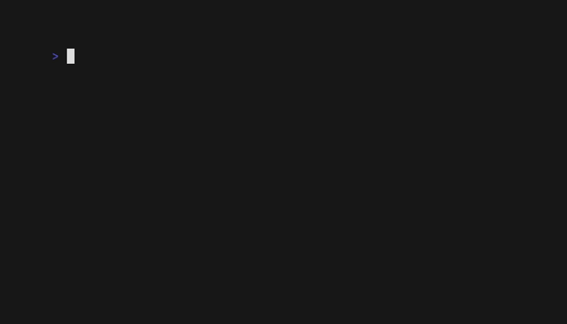

# proper7y

[](https://github.com/rnazmo/proper7y/actions/workflows/ci.yml)
[](https://github.com/rnazmo/proper7y/actions/workflows/scheduled.yml)

Tiny Bash script to print basic system information in consistent format.

> **Note on terminology used in this document:**
> `proper7y` refers to the file (the script itself),
> 'proper7y' refers to the project (≒ the repository), and
> `$ proper7y` refers to the command on your console.



## TL;DR

`proper7y` is a tiny Bash script that prints basic system information
in a consistent, easy-to-copy format. Useful for attaching environment
details to technical articles or bug reports.

```console
$ ./proper7y
proper7y v0.9.3 - Tiny Bash script to print basic system
information. See: https://github.com/rnazmo/proper7y
============================================================
CURRENT DATE  : 2026-04-19
VIRTUALIZATION: Hyper-V
CHASSIS       : N/A
CPU ARCH      : x86_64
OS NAME       : Ubuntu
OS VERSION    : 24.04
CURRENT SHELL : Bash
BASH VERSION  : 5.2.21
============================================================
```

## Documentation for users

NOTE: These are documents to my future self.

### Purpose of this project

- **For my own use**
- For learning bash script

NOTE: So, I will only support environments and software that I use frequently.

#### Scope of displayed information

proper7y outputs **machine-global environment information** only.
This means information that is tied to the machine itself, such as OS, CPU architecture,
shell, and virtualization environment.

Project-local information (e.g. React version, Vite version) is out of scope,
as it varies per project rather than per machine. (Ref: ADR-021)

#### Support policy

| Environment           | Target                           | Support level                                 |
| --------------------- | -------------------------------- | --------------------------------------------- |
| User environment      | Linux (Arch-based, Debian-based) | Full support                                  |
| User environment      | macOS                            | Best-effort (works in CI, but not guaranteed) |
| User environment      | Shell: Bash (>= 4.0), Zsh        | Full support                                  |
| Developer environment | Linux x64                        | Full support                                  |
| Developer environment | macOS                            | Not supported                                 |

**Supported OS details:**

- **Arch-based:** Arch Linux, EndeavourOS, Manjaro
- **Debian-based:** Debian, Kali Linux, Ubuntu

**Why macOS is best-effort:** I don't have a macOS machine for hands-on testing. CI (`macos-latest`) confirms basic functionality, but macOS-specific bugs may not be caught immediately.

**Why developer environment is Linux x64 only:** `devel-tools` scripts depend on Linux/x64 binaries (shellcheck, shfmt) and GNU sed syntax. Exception: `run-integ-test.bash` works on both Linux and macOS (see ADR-012).

### Installation

#### Using Script (recommended) - Install the latest release version

If you want to install proper7y command under `${HOME}/.bin/`,
run commands on your terminal like:

```console
DEST_DIR="${HOME}/.bin"

cd "$(mktemp -d)" && \
    curl -O https://raw.githubusercontent.com/rnazmo/proper7y/main/install.bash && \
    chmod +x install.bash && \
    ./install.bash "$DEST_DIR"
```

To check that you installed it successfully:

```console
"${HOME}/.bin/proper7y"
```

#### Manually - Install the specified release version

1. Download `proper7y` file from GitHub's raw page, **specifying any version** (Use a link like [this](https://raw.githubusercontent.com/rnazmo/proper7y/v0.0.1/proper7y) one.)
2. Add the file to the environment PATH (optional)
3. Add execute permission (like `chmod +x ./proper7y`)
4. Run (like `./proper7y`)

```console
$ DEST_DIR="${HOME}/.bin"

$ VERSION="v0.0.1"

$ cd "$DEST_DIR" && \
    curl -O https://raw.githubusercontent.com/rnazmo/proper7y/"$VERSION"/proper7y && \
    chmod +x ./proper7y

$ ./proper7y
TODO: Example result log here
```

### Using without installation

Just run commands like the following in your terminal.

```console
/bin/bash -c "$(curl -fsSL https://raw.githubusercontent.com/rnazmo/proper7y/v0.3.0/proper7y)"
```

### How to bump a version of my 'proper7y'

1. Delete you old `proper7y` file.
2. Install a new version of 'proper7y'. (See [Installation](https://github.com/rnazmo/proper7y#installation) section.)

### Examples

```console
$ ./proper7y
proper7y v0.9.3 - Tiny Bash script to print basic system
information. See: https://github.com/rnazmo/proper7y
============================================================
CURRENT DATE  : 2026-04-18
VIRTUALIZATION: Physical
CHASSIS       : laptop
CPU ARCH      : x86_64
OS NAME       : Ubuntu
OS VERSION    : 24.04
KERNEL VERSION: 6.8.0-45-generic
CURRENT SHELL : Bash
BASH VERSION  : 5.2.21
============================================================
```

```console
$ ./proper7y
proper7y v0.9.3 - Tiny Bash script to print basic system
information. See: https://github.com/rnazmo/proper7y
============================================================
CURRENT DATE  : 2026-04-18
VIRTUALIZATION: Docker
CHASSIS       : N/A
CPU ARCH      : x86_64
OS NAME       : Debian
OS VERSION    : 12
KERNEL VERSION: 6.8.0-45-generic
CURRENT SHELL : Bash
BASH VERSION  : 5.2.15
============================================================
```

### Notes

#### Do not download (install) 'proper7y' without specifying the version

TL;DR: **Use `install.bash`**. Or Download `proper7y` file directly **with specifying a version**

Don't download `proper7y` directly from the `main` branch,
but download it directly using a tag such as "v0.0.1".

Or, I highly recommend you to download `proper7y` via `install.bash`.
If you download `install.bash`, it is also allowed from the `main` branch.

If you do not specify the version (for example, if you download `proper7y` directly from the `main` branch),
the version information of 'proper7y' itself in the output of `proper7y` can be incorrect.

e.g.,

```console
# BAD:
$ curl -O "https://raw.githubusercontent.com/rnazmo/proper7y/main/proper7y"
```

```console
# GOOD:
$ curl -O "https://raw.githubusercontent.com/rnazmo/proper7y/v0.0.1/proper7y"
```

I highly recommend you to use `install.bash` to avoid these mistakes.

```console
# GOOD (Recommend)
$ DEST_DIR="${HOME}/.bin"
$ cd /tmp && \
    curl -O https://raw.githubusercontent.com/rnazmo/proper7y/main/install.bash && \
    chmod +x ./install.bash && \
    ./install.bash "$DEST_DIR"
```

## Documentation for developers

NOTE: These are documents to my future self.

### Policies

- Simple usage (≒ option)
- Simple code
  - Tiny code size
  - Fewer files
  - Minimum dependencies
- Simple documentation
  - Keep important documentation in `README.md`, `TODO.md`, `ADR.md`, and inline code comments.
  - Avoid scattering information across multiple places.
    - **Should not using 'Issue'**
    - **Should not using 'Pull Request'**
    - Shall not using 'Wiki'
- Easy to maintain
  - Support only environment/software that I use frequently

### Conventions

- **SHALL**: A rule that must always be followed. No exceptions.
- **SHOULD**: A rule that should generally be followed. Exceptions are permitted with reasonable justification.

#### Versioning

Follow semantic versioning. (SHALL)

### Branch

- **Prefer keeping only `main` branch whenever possible. (SHOULD)**
- However, creating temporary branches for large changes (e.g., new features) is acceptable. (SHOULD)
- Delete temporary branches promptly after merging. (SHOULD)

#### Commit message

Follow [Conventional Commits](https://www.conventionalcommits.org/en/v1.0.0/). (SHOULD)
See ADR-009 for the rationale and detailed rules.

This project is personal, so strict enforcement is not required. Continuing to commit matters more than writing a perfect message.

**Commit types used in this project:**

- `feat`: new feature
- `fix`: bug fix
- `docs`: documentation only
- `style`: formatting, no logic change
- `refactor`: neither fix nor feature
- `test`: adding or updating tests
- `chore`: build process or tooling changes (e.g. bumping devel-tools versions)

**Scope** (optional): Use when the target is clear (e.g. `feat(install): ...`, `chore(shfmt): ...`, `docs(ADR): ...`).

**Examples:**

- `chore: bump project version: v0.9.3 -> v0.10.0`
- `chore(shellcheck): bump devel-tool version: v0.10.0 -> v0.11.0`
- `docs(README): add TL;DR section`
- `refactor(proper7y): split init() into check_prerequisites() and identify_environment() (ADR-013)`

#### Issues / Pull requests

**Avoid writing important information in Issues / Pull requests. (SHALL)**

Because it is difficult to search and maintain the information written there.

#### Issue / Pull request title

No specific rules. Keep it casual.

#### Documentation

Although not preferred, it is okay to have a mixture of English and Japanese. (SHOULD)
(The target reader of these documents is my future self.)

**Language policy for each document type:**

| Document type   | Language | Rationale                                                                    |
| --------------- | -------- | ---------------------------------------------------------------------------- |
| Code comments   | English  | Code itself is in English; keeping comments in English maintains consistency |
| Commit messages | English  | Follows Conventional Commits standard; English is the de facto standard      |
| README.md       | English  | Public-facing documentation; English allows broader accessibility            |
| ADR.md          | Japanese | Internal decision records; Japanese allows faster writing for the author     |
| TODO.md         | Japanese | Internal task list; Japanese allows faster writing for the author            |
| CHANGELOG.md    | Japanese | Internal release notes; Japanese allows faster writing for the author        |

This policy balances accessibility (English for public docs) with productivity (Japanese for internal docs where the primary reader is the author).

#### Code Style for Bash Script (Lint, Format)

Follow shellcheck and shfmt. (SHALL)

Also follow [Google Shell Style Guide](https://google.github.io/styleguide/shellguide.html) for rules not covered by the above tools. Key rules adopted in this project:

**Naming**

- Function names: `lowercase_with_underscores` (SHALL)
- Constants and readonly globals: `UPPER_SNAKE_CASE` with `readonly` (SHALL)
- Mutable globals: `UPPER_SNAKE_CASE` without `readonly` (SHALL)
- Local variables: `lowercase_with_underscores` with `local` or `local -r` (SHALL)

**Functions**

- Always declare function-scoped variables with `local` or `local -r`. (SHALL)
- Functions intended only for use within the same file should be prefixed with `_`. (SHOULD)
  Calling `_`-prefixed functions from another file (e.g. via `source`) is prohibited. (SHALL)
- Document non-trivial functions with a comment block above the definition. Use the following format: (SHOULD)

```

# TL;DR (What is this?):
#   Short description of what this function does.
#
# Usage:
#   function_name <arg1> <arg2>
#
# Example:
#   function_name "foo" "bar"
#
# NOTE:
#   Any important caveats or constraints.

```

**File header**

- Each script file should begin with a header comment in the following format: (SHOULD)

```

# TL;DR (What is this?):
#   One-line summary of what this script does.
#
# Usage:
#   ./script-name.bash <args>
#
# NOTE:
#   Any important prerequisites or constraints.

```

**Error handling**

- Always use `set -eu` at the top of every script. (SHALL)
- Use `exit 1` in top-level scripts and `return 1` in library functions (`common.bash`). See ADR-010. (SHALL)

**Quoting**

- Always double-quote variables: `"$VAR"` not `$VAR`. (SHALL)
- Exception: inside `[[ ]]`, quoting is optional but still preferred. (SHOULD)

**Misc**

- Use `[[ ]]` instead of `[ ]` for conditionals. (SHALL)
- Use `$(...)` instead of backticks for command substitution. (SHALL)
- Always add `exit 0` at the end of top-level scripts. See ADR-011. (SHALL)

Ref:

- [Shell scripting standards and style guidelines | GitLab](https://docs.gitlab.com/ee/development/shell_scripting_guide/#code-style-and-format)
- [Google Shell Style Guide](https://google.github.io/styleguide/shellguide.html)
- [ShellCheck](https://github.com/koalaman/shellcheck)
- [shfmt](https://github.com/mvdan/sh)

#### Force push to the remote repo

Should be avoided, but allowed when absolutely necessary. (Since the only user is myself)

### Prerequisite

**Only the following machine are supported as development environments**:

- **Linux x64**

Note: `devel-tools` scripts (lint, format, install, bump, etc.) depend on
Linux/x64 binaries (shellcheck, shfmt) and `GNU sed`, so they only work on
Linux/x64. The exception is `run-integ-test.bash`, which has no such
dependency and works on both Linux and macOS. (Ref: ADR-012, ADR-020)
(Unlike the other devel-tools scripts, which are Linux/x64-only.)

### How to setup your development environment

1. Check if your machine meet [the prerequisites](https://github.com/rnazmo/proper7y#prerequisites)
2. Clone this repository under any directory on the machine. (`git clone git@github.com:rnazmo/proper7y.git`)
3. [Install the dependencies using the scripts](https://github.com/rnazmo/proper7y#how-to-install-devel-tools)

### How to install devel-tools

```console
make install-devel-tools
```

### Directory structure of devel-tools

devel-tools uses two different installation patterns depending on the tool's distribution format:

**Single binary tools** (shellcheck, shfmt):

- Placed directly in `devel-tools/bin/`
- Example: `devel-tools/bin/shellcheck`

**Multi-file tools** (bats):

- Installed in `devel-tools/opt/<tool_name>/` with their complete directory structure
- Symlinked from `devel-tools/bin/<tool_name>` for consistent access
- Example: `devel-tools/opt/bats/` (installation) → `devel-tools/bin/bats` (symlink)

This design keeps `devel-tools/bin/` as the unified entry point while allowing self-contained installation for tools that require multiple files or directories.

The `opt/` directory follows the Filesystem Hierarchy Standard (FHS) convention: a place for optional software packages where each tool maintains its own self-contained directory structure.

### How to bump a version of devel-tools

#### Using script

Just run:

```console
make check-devel-tools-versions
```

#### Manually

1. Edit and bump the versions in `/devel-tools/script/common.bash`. (like `SHELLCHECK_CURRENT_VERSION="v0.7.2"`, `SHFMT_CURRENT_VERSION="v3.3.0"`)
2. Create a commit for the change with the commit message (like `Bump devel-tool version (shfmt): v3.5.1 -> v3.6.3`).
3. Push the commit (like `$ git push`).

### How to upgrade a version of devel-tools

Same as the how to install devel-tools. (Just run `make install-devel-tools`).

### How to run lint

NOTE: Install devel-tools before running lint.

```console
make lint
```

### How to run format

NOTE: Install devel-tools before running format.

NOTE: This overwrite the files. Save it before running.

```console
make format
```

### How to run integration-test

```console
make integ-tests
```

### How to update the demo GIF

Update the demo GIF when the output format of `proper7y` changes noticeably
(e.g. new fields added, layout changed). Minor changes do not require an update.

#### Prerequisites

Install VHS and its dependencies. The following command is for **Arch-based Linux** only:

```console
sudo pacman -S ffmpeg ttyd vhs
```

For other environments, see the [VHS installation guide](https://github.com/charmbracelet/vhs#installation).

#### Steps

1. Run VHS to generate the GIF
2. Move the generated GIF to the correct location
3. Commit the updated GIF

The GIF is already embedded in README.md, so no further changes are needed.

Commands:

```bash
# Step 1:
vhs ./devel-tools/demo/proper7y.tape

# Step 2:
mv ./proper7y.gif ./devel-tools/demo/proper7y.gif

# Step 3:
git add devel-tools/demo/proper7y.gif
git commit -m "docs(demo): update demo GIF"
```

### How to bump a version of 'proper7y' (versioning workflow)

0. (We edited `proper7y` locally.)
1. Create a commit for the changes with any commit message.
2. Push the changes (like `$ git push`).
3. Ensure that the CI to the commit passes. (And if the CI falls, we go back to step 0.)
4. Update `CHANGELOG.md` before bumping. See the workflow in ADR-007 for details.
5. Run the script and bump the project version: `$ make bump-project`

MEMO: The script do following:

1. Edit and bump a version of `VERSION="v0.0.X"` in `proper7y`, `install.bash`, and `/devel-tools/script/common.bash`. (Don't forget to follow semantic versioning!)
2. Create a commit for the change with the commit message (like `Bump a version to v0.0.3`).
3. Add a Git tag **to the commit** (like `$ git tag v0.0.3`).
4. Push the commit and tags (like `$ git push --atomic origin main v0.0.3` . ref: <https://stackoverflow.com/a/3745250>).

### ADR

See: [ADR.md](./ADR.md)

### TODO

See: [TODO.md](./TODO.md)

## Memo

### Linting

#### Options of shfmt

- `-i` : Specify indent size
- `-d` : Error when the formatting differs

Ref:

- [Shell scripting standards and style guidelines | GitLab](https://docs.gitlab.com/ee/development/shell_scripting_guide/#formatting)
- [sh/shfmt.1.scd at f33507475241da6fc37b972d825c351b94300bab · mvdan/sh](https://github.com/mvdan/sh/blob/f33507475241da6fc37b972d825c351b94300bab/cmd/shfmt/shfmt.1.scd)

Example:

```console
shfmt -i 2 -d ./proper7y ./install.bash
```

### Formatting

#### Options of shfmt

- `-w`: Write result to file instead of stdout.

### Pre-commit

```console
make pre-commit
```

### Pre-push

```console
make pre-push
```
